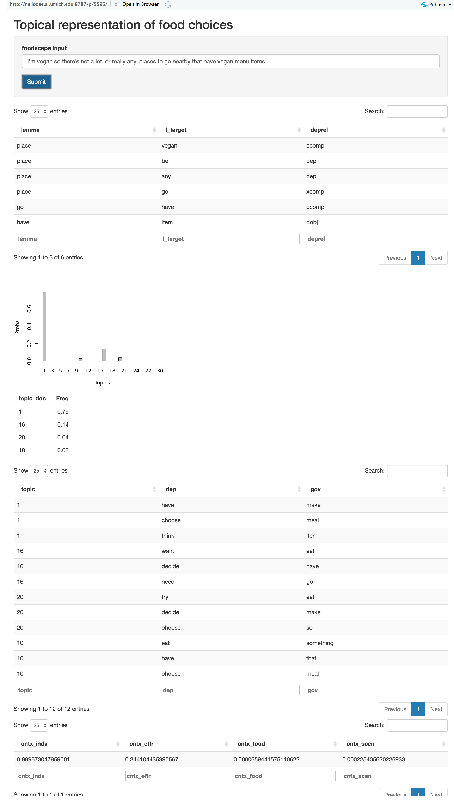
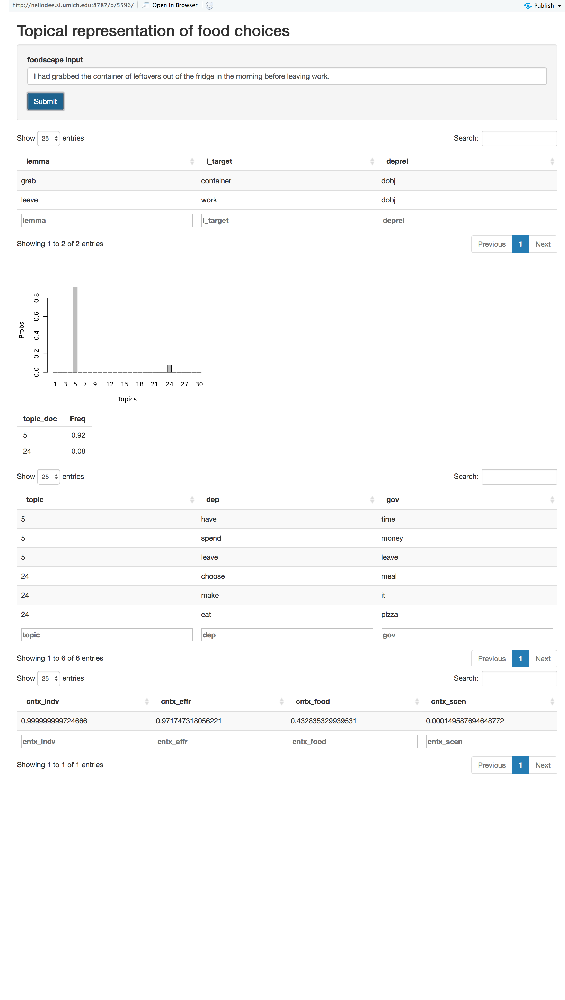
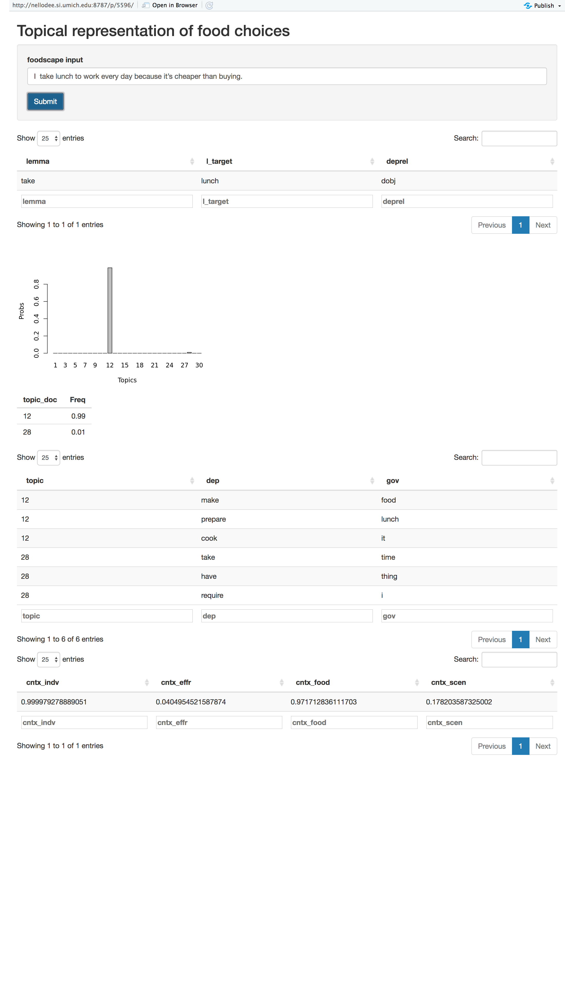
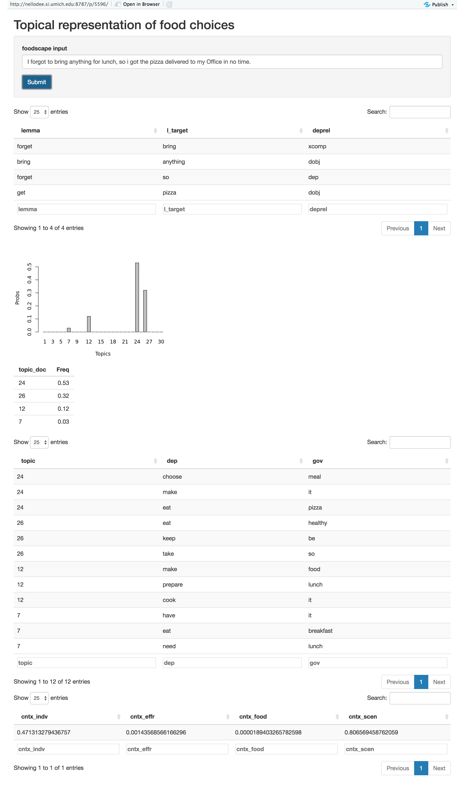

# Foodscape: A Shiny-app

We make decisions related to food every day, and the decisions are largely dependent on situational contexts, such as location, weather, business, or even social interactions.
Foodscape is an interactive Shiny app that can present interpretable machine learning results to understand how people decide on what to eat. The app uses a topic model variant ([Bi-modal topic model](https://github.com/sungjinnam/bimodal_topic_model)) to represent the sentence input, and logistic regressions to classify the types of context.
*Note: This code sample does not contain the sentence data or model weights.*

## System Description

### Input

The application takes a sentence input about why they decide to have a particular choice of food (E.g., "I made a spaghetti dinner because I had all the ingredients and it is easy to make.").

### Topic Modeling Results

The application analyzes the grammatical dependency structure from a sentence. For the preliminary study, we collected about 500 sentences from people describing their food-related decision.

First, we used coreNLP's to extract the list of grammatical dependent pairs. For this version, we arbitrarily selected particular types of relationships, like object relationship (e.g., *make dinner*), complement (e.g., *looks delicious*), or dependent (e.g., *place (to) go*), as more important dependency relations to describe the context of food choices.

Second, we trained a bi-modal topic model that learned jointly from dependency word pairs. The application shows the chart for topic probability distributions of the input sentence. It also includes other example topical words that can be found from the non-zero probable topics to provide more context of the selected topics of the input sentence.

### Prediction Results

Using the topical representation as features, the application classifies the type of context (i.e., *Why does who eat what, when, and where?*). Based on the qualitative study, we classified the foodchoice pattern into four categories with example key terms:

- **Individual**: medical, lifestyle, mood, routine, seldom, desire, reward
- **Effort**: ease, availability
- **Food**: taste, cost, visual, health, form
- **Scene**: social, source, weather, regional, activity

For this version, we used simple logistic regression models (e.g., predicting each category as a binary label). Each decimal number under the category shows the probability of the binary label.

## Future Works

- Improve prediction performance.
  - Train the topic model with more data.
  - Employ more sophisticated prediction models for multi-labels, e.g., random forest, softmax regression, etc.
- Context categories that can ensure high inter-rater agreement rates.
- User study.

## Example Screenshots

- Individual: "I'm vegan so there's not a lot, or really any, places to go nearby that have vegan menu items."

- Effort: "I had grabbed the container of leftovers out of the fridge in the morning before leaving work"

- Food: "I take lunch to work every day because it's cheaper than buying"

- Scene: "I forgot to bring anything for lunch, so i got the pizza delivered to my Office in no time."
